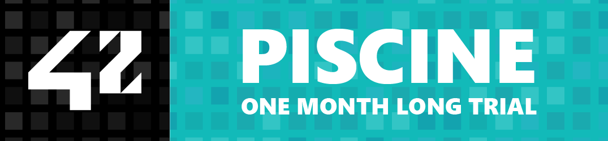

# 1337-MED


## Overview

Welcome to my repository containing all the work I completed during the 1337 Piscine. This repository is organized by the different "days" or modules of the Piscine, including various C programming exercises, shell scripts, and other projects.

## Repository Structure

| Directory/Path         | Description                                      |
|------------------------|--------------------------------------------------|
| `README.md`            | Main README file for the repository.             |
| `days/Rush/`           | Contains files related to the Rush project.      |
| `days/Rush01/ex00/`    | Various C files for the Rush01 project.          |
| `days/c00/`            | Contains exercises for the c00 project.          |
| `days/c01/`            | Contains exercises for the c01 project.          |
| `days/c02/`            | Contains exercises for the c02 project.          |
| `days/c03/`            | Contains exercises for the c03 project.          |
| `days/c04/`            | Contains exercises for the c04 project.          |
| `days/c05/`            | Contains exercises for the c05 project.          |
| `days/c06/`            | Contains exercises for the c06 project.          |
| `days/c07/`            | Contains exercises for the c07 project.          |
| `days/c08/`            | Contains exercises for the c08 project.          |
| `days/shell00/`        | Contains exercises for the shell00 project.      |
| `days/shell01/`        | Contains exercises for the shell01 project.      |
| `pointers/`            | Miscellaneous C files related to pointers.       |

## Overview

This repository is a comprehensive collection of the projects and exercises I completed during the Piscine. Each file represents a step in my journey to mastering C programming, shell scripting, and problem-solving skills.

### C Programming Exercises

    The **c00** to **c08** directories contain various exercises designed to build a strong foundation in C programming. These exercises cover everything from basic output functions to more complex algorithms like recursive functions, string manipulation, and data structures.

### Shell Scripting

    The **shell00** and **shell01** directories focus on mastering the Unix shell. The exercises range from basic commands to more advanced scripting techniques.

### Rush Projects

    The **Rush** and **Rush01** directories are where I implemented more extensive projects, combining the skills learned throughout the Piscine. These projects were designed to test both individual coding skills and teamwork.

## How to Use

To explore a specific module or exercise, navigate to the corresponding directory and review the source code. If you want to compile and run any of the C programs:

```bash
gcc -Wall -Wextra -Werror -o output_file source_file.c
./output_file
```

For shell scripts, simply navigate to the appropriate directory and execute them:

```bash
./script_name.sh
```
---



## PROJECTS
<div align="center">
	
| Shell Project | Grade |
| :--- | :--- |
| [Piscine Shell 00] |  |
| [Piscine Shell 01] |  |

| C Project | Grade |
| :--- | :--- |
| [Piscine C 00]() |  |
| [Piscine C 01]() |  |
| [Piscine C 02]() |  |
| [Piscine C 03]() |  |
| [Piscine C 04]() |  |
| [Piscine C 05]() |  |
| [Piscine C 06]() |  |
| [Piscine C 07]() |  |
| [Piscine C 08]() |  |

| Rush Project | Grade |
| :--- | :--- |
| [Piscine Rush 00](https://github.com/jotavare/42-piscine/tree/main/piscine/C%20Piscine%20Rush%2000) |  |
| [Piscine Rush 01](https://github.com/jotavare/42-piscine/tree/main/piscine/C%20Piscine%20Rush%2001) |  |
</div>
	
## EXAMS
<div align="center">

| Exam Rank | Language | Finish Date | Grade | Time |
| :--- | :--- | :--- | :--- | :--- |
| Exam 00 | `C` | 30-09-2022 |  | `4 hours` |
| Exam 01 | `C` | 07-10-2022 |  | `4 hours` |
| Exam 02 | `C` | 14-10-2022 |  | `4 hours` |
| Final Exam | `C` | 21-10-2022 |  | `8 hours` |

</div>

## Conclusion

The Piscine was an intensive and rewarding experience, and this repository serves as a testament to the hard work and dedication required to complete it. I hope this collection of code helps others who are preparing for the Piscine or who are simply interested in exploring different coding exercises and projects.

Feel free to explore and reach out if you have any questions or feedback!

---

*This repository is for educational purposes only. Unauthorized copying or distribution of this work is prohibited.*


